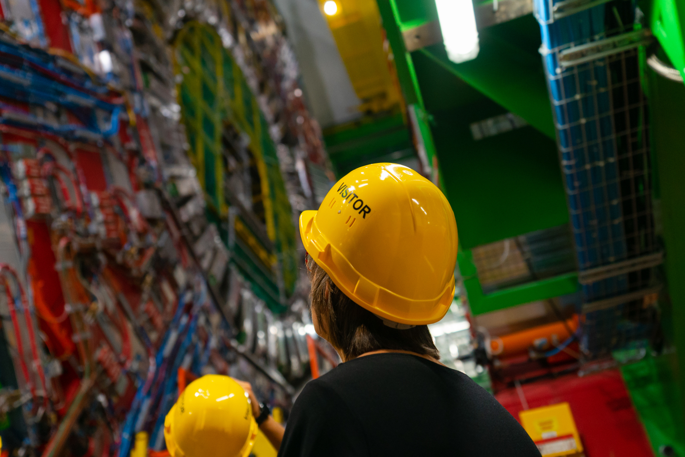

# My journey as a Project Manager

## *or how I learned to stop worrying about deadlines*.

### Pedro Ferreira

---
# Who am I?

* 36 years old
* Portuguese 🇵🇹
* Software Engineer 👨🏻‍💻
* Working at CERN since 2007

---
# Structure of the Talk

* What is CERN?
* My experience as a Manager:
  * Indico - Project Manager (2014 - 2020)
  * CS3MESH4EOSC (2020 -)
* Some thoughts

---
# What is CERN?

It means, *obviously*

## European Organization for Nuclear Research

(formerly known as **C**onseil **E**uropéen pour la **R**echerche **N**ucléaire)

or, in a more understandable way,

# European Laboratory for Particle Physics

---

<!-- _footer: © Copyright CERN --->

---

<iframe scrolling="no"  src="https://videos.cern.ch/record/2020780/embed" width="100%" height="100%" frameborder="0" allowfullscreen></iframe>

<!-- _footer: © Copyright CERN --->

---

<!-- _footer: © Copyright CERN --->

---

### 

 - **Event Management** System
 - Core Developed at **CERN**
 - **Collaborative effort** - Open Source
 - \> **70 developers** over the years
 - \> **150 servers** world wide

---

# History

 - **1999** - **CDS Agenda**
 - **2002** - **EU Project**
 - **2004** - First **Conference**
 - **2007** - **Room Booking**
 - **2009** - **Video Conferencing**
 - **2013** - First **Workshop**
 - **2015** - **UNOG** starts using it
 - **2017** - Indico 2.0 (**rewrite**)
 - **2021** - Indico 3.0 (Python 3)

---

# Philosophy

 - "Agnostic" **core**
 - **Plugins** 🧩
 - **Themes** 🎨
 - Developed **publicly**

---

# Context

 * Small team, significant turnover
 * Team also does support and bug fixing
 * Development happens a lot around GitHub (especially now!)
 * Reliance on chat tools (even pre-COVID)

---

# The Team

---

# The Portfolio

 * Indico (> 300K lines of code) + Plugins
 * newdle (meeting scheduling)
 * Flask libraries
 * mereswine (community metrics)

---

# The Methodology

 * It's... complicated
     - not the methodology, the choice
 * Kanban-based
 * Elements from Crystal Clear
 * Updated for the GitHub era

---

# The problem with "Agile"

 * Typical "Agile methodologies" are tailored for **larger teams**
 * Not conceived with GitHub and Slack/Mattermost (or Open Source!) in mind
   - e.g. Scrum adds some **overhead** in meetings
 * "Agile" should be about "**less process, more people**" - "enterprise Agile" seems to go the other way.

---

# Back to the fundamentals

## Agile manifesto

 * **Individuals and interactions** over processes and tools
 * **Working software** over comprehensive documentation
 * **Customer collaboration** over contract negotiation
 * **Responding to change** over following a plan

---

# The Indico Software Development Methodology

---

## Typical Delivery cycle

 * Collecting/prioritizing user stories (e.g. tickets)
 * Creating Mockups
 * Kanban-based development sprint (~2 months)
 * Validation tests with users, iteration
 * Public release
 * Release Reflection Workshop
   - Process is iterated upon

---

## The "task" cycle

 * Developer takes task from the "TODO" list
 * Sends PR once done (sometimes draft PR if it's too long), now "in review"
 * PR is reviewed by at least two other people, iterated upon
 * PR is merged into the development branch

---

---

## Other elements

 * Pair programming (highly appreciated by developers!)
 * Continuous Integration
 * Automatic enforcement of code guidelines

---

## Evolution

 * Phase 1 - "We can do it!"
 * Phase 2 - "We'll do what we can"
 * Phase 3 - Community-based Development

___

# Phase 1
## We can do it!

**Context (2014):** Gigantic DB migration  (technical debt payoff)

 * \> 11 major releases in 3 years
 * \> 10.000 individual commits
 * 6167 changed files
 * \> 800 Pull Requests

---

# Phase 1

---

# Phase 1

ESTIMATE ALL THE THINGS!

---

# Phase 1
## We can do it!

... but we're not sure by when.

---

# Phase 2
## "We'll do what we can"

---

# Phase 2
## "We'll do what we can"

* Improve prioritization
* More restricted set of "must-have" features
* Deliver earlier, add the frosting later
* Typically:
  - First "bare-bones" release
  - A cycle of smaller releases with bug fixes and "nice to have"

---

# Phase 3
## Community-based Development

---

# Phase 3
## Community-based Development

* New stakeholders
  - Signifcant increase in Open Source contributions
  - Greater availability of funding for isolated developments
  - UN enters the game in 2015
* Need for a clearer medium-long-term roadmap
* Need for a "constitution" of Indico

---

---

# CS3MESH4EOSC

* **3-year** project
  - Started **January 2020**
* **13 partners** (including WWU!)
* **~6M EUR**

---

# The Idea

 * **Decentralized** mesh of EFSS nodes
 * Based on **Open Standards** and **Open Source**
 * **Federated** environment for collaborative research
 * **Application platform** for distributed collaboration

---

# My role

 * WP1 (Management) Leader
   - High-level management
   - Ensuring implementation of Work Plan
   - Interfacing between partners
   - Communication with EC
 * Technical Coordinator
   - Ensuring technical WPs work together

---

# Differences (vs. Indico)

 * Larger "team"
 * Beyond CERN's borders
 * Less direct contact with technology
 * "Bureaucracy"
 * Process is much more formalized
 * Lots of Synchronization work
   - Technical teams work in parallel

---

# The Methodology

 * Framework imposed by the EC
 * Work Packages, Tasks, Milestones and Deliverables
 * Reviews (in this case only one, mid-Project)
 * Plans
   * Quality Assurance
   * Data Management
   * Risk Management
   * Intellectual Property Rights

---

# Quality Assurance

 * Rules on **Project Meetings**
   - when, where and with whom
   - how they're documented
 * **Collaborative tools**
   - Mailing lists, document stores, Indico, Wiki...
 * **Work Plan** Managament
   - how it's set up, reviewed and executed
 * **Deliverable** submission and reviewing
 * **Decision making**

---

# Risk assessment

* Risk assessment table
   - Likelihood
   - Severity
   - Mitigation measures
* e.g.
    - *critical staff leaving*
    - *user community interest drops*
    - *Future lockdowns* (added 2020)
* Reviewed periodically

<!-- _footer: © Copyright CERN --->

---
# Data Management

* Especially relevant in Projects where research data is collected
  * *e.g. clinical trial data, surveys*
* Compliance with GDPR
* Software Products: privacy-first approach

---

# Intellectual Property

* Copyright-protected or patentable
  * **Background IP**: pre-existing, belonging to the partners
  * **Foreground IP**: produced in the context the Project
* Ownership and Licensing
* Protection of Results

---

# The Work Plan

 * Managed on GitHub kanban (for convenience)
 * Every 1st StC meeting of the month: review
   -  "Snapshot" produced and circulated to members of the StC

---
# Personal notes

---
# On Deadlines

> And he, the said Wirz, still wickedly pursuing his evil purpose, did establish and cause to be designated within the prison enclosure containing said prisoners a "dead line," [...] [and he] instructed the prison guard stationed around the top of said stockade to fire upon and kill any of the prisoners aforesaid who might touch, fall upon, pass over or under [or] across the said "dead line"
>
> *"Trial of Henry Wirz," Report of the Secretary of War, Oct. 31, 1865*

---
# On Deadlines

* Necessary evil
* Safety > Quality > Production
* Leave always some leeway
* Sometimes they're worth failing

---
# Decision-making

* Make informed decisions
* You're a Manager not an Oracle
* Proactively seek other people's opinion

---
# Building from the Foundations

* "Baby steps"
* Evolution >>> Revolution

---
# Saying "No"

* Sometimes you have to be the killjoy
* Look at the facts and ask those around you
* Saying "no" is not necessarily selfish
* You owe that to yourself and those who work with you

---
# Testing

* Test early, test often
* Test with real users
* If it hasn't been tested by users, it's not production-ready

---
# Thank you!

## @pferreir

https://getindico.io
https://cs3mesh4eosc.eu

---
# Credits

 * ["Data" photo](https://www.pexels.com/photo/code-on-computer-screen-3861976/) by ThisIsEngineering from Pexels
 * Crane accident image from the CERN media archives (Copyright CERN)
 * All logos are property of the respective projects and mean no endorsement
